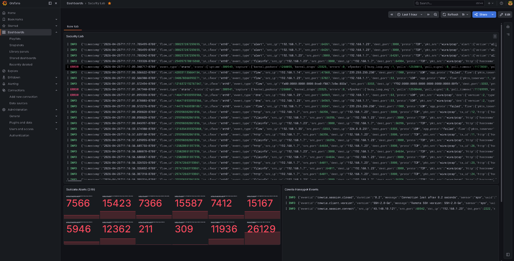
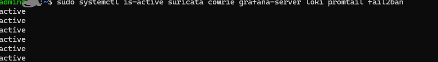

# 🛡️ Raspberry Pi 5 — Home Security Lab

A fully automated cybersecurity home lab built on a Raspberry Pi 5 (8GB) running Ubuntu Desktop. This project demonstrates practical blue-team security skills across four phases: system hardening, intrusion detection, honeypot deployment, and real-time log visualization.

> **Built to showcase:** Linux administration, network security, threat detection, log analysis, and security tooling — skills relevant to SOC Analyst, IT Security, and Systems Administrator roles.

---

## 📸 Dashboard Preview



---

## 🏗️ Architecture

```
Internet Traffic
      │
      ▼
┌─────────────────────────────────────────────┐
│           Raspberry Pi 5 (Ubuntu)           │
│                                             │
│  ┌─────────┐    ┌──────────┐    ┌────────┐ │
│  │  UFW    │    │ Suricata │    │ Cowrie │ │
│  │Firewall │    │   IDS    │    │Honeypot│ │
│  └─────────┘    └────┬─────┘    └───┬────┘ │
│                      │              │      │
│              ┌───────▼──────────────▼────┐ │
│              │        Promtail           │ │
│              │     (Log Shipper)         │ │
│              └───────────┬───────────────┘ │
│                          │                 │
│              ┌───────────▼───────────────┐ │
│              │          Loki             │ │
│              │    (Log Aggregator)       │ │
│              └───────────┬───────────────┘ │
│                          │                 │
│              ┌───────────▼───────────────┐ │
│              │        Grafana            │ │
│              │    (Live Dashboard)       │ │
│              └───────────────────────────┘ │
└─────────────────────────────────────────────┘
```

---

## 🔧 Hardware

| Component | Spec |
|---|---|
| Device | Raspberry Pi 5 |
| RAM | 8GB |
| OS | Ubuntu Desktop 24.x |
| Network | Wired Ethernet (eth0) |

---

## 📋 Project Phases

### Phase 1 — Security Hardening
**Script:** [`pi5_hardening.sh`](pi5_hardening.sh)


Automates hardening of a fresh Ubuntu install following CIS benchmark principles.

| Control | Implementation |
|---|---|
| User management | Dedicated admin user, root login disabled |
| Authentication | SSH key-based auth, password auth disabled |
| Network | UFW firewall, default-deny incoming policy |
| Brute force protection | fail2ban (3 retries, 1hr ban) |
| Service reduction | Disabled Bluetooth, CUPS, Avahi, ModemManager |
| Patch management | Unattended security updates enabled |

**Key concepts demonstrated:**
- Principle of least privilege
- Attack surface reduction
- Defense in depth
- CIS benchmark controls

---

### Phase 2 — Intrusion Detection System (Suricata)
**Script:** [`pi5_suricata_setup.sh`](pi5_suricata_setup.sh)


Deploys Suricata 7.x as a network IDS monitoring all traffic on the primary interface.

| Feature | Detail |
|---|---|
| Engine | Suricata 7.x (OISF official repo) |
| Mode | IDS (passive monitoring) |
| Rules | 49,770+ Emerging Threats signatures |
| Interface | eth0 (auto-detected) |
| Output | eve.json (JSON), fast.log (alerts) |
| Log rotation | Daily, 7 days retention, compressed |

**Sample alert caught:**
```
[1:2100498:7] GPL ATTACK_RESPONSE id check returned root
Classification: Potentially Bad Traffic | Priority: 2
3.169.231.53:80 -> 192.168.1.23:52254
```

**Key concepts demonstrated:**
- Network traffic analysis
- Signature-based detection
- Rule management and updates
- JSON log parsing
- Blue team / SOC analyst tooling

---

### Phase 3 — SSH Honeypot (Cowrie)
**Script:** [`pi5_cowrie_setup.sh`](pi5_cowrie_setup.sh)


Deploys Cowrie 2.9. x as a medium-interaction SSH honeypot, logging all attacker activity.

| Feature | Detail |
|---|---|
| Engine | Cowrie 2.9.17 |
| Protocol | SSH (port 2222) |
| Isolation | Dedicated unprivileged user |
| Environment | Python virtualenv |
| Logging | JSON session logs with full TTY recording |
| Service | systemd with auto-restart |

**Sample session captured:**
```json
{"eventid":"cowrie.login.success","username":"root","password":"yes1234"}
{"eventid":"cowrie.command.input","input":"whoami"}
{"eventid":"cowrie.command.input","input":"cat /etc/passwd"}
{"eventid":"cowrie.session.closed","duration":"39.5"}
```

**What gets logged per attacker session:**
- Source IP and port
- SSH client version and fingerprint (HASSH)
- Every credential attempt
- Every command typed
- Files downloaded/uploaded
- Full TTY session replay

**Key concepts demonstrated:**
- Honeypot deployment and operation
- Threat intelligence collection
- Attacker behavior analysis
- Principle of least privilege (isolated service user)
- Python virtualenv management

---

### Phase 4 — Live Security Dashboard (Grafana + Loki)
**Script:** [`pi5_dashboard_setup.sh`](pi5_dashboard_setup.sh)
Builds a real-time security dashboard aggregating logs from Suricata and Cowrie.

| Component | Role |
|---|---|
| Grafana | Dashboard UI (port 3000) |
| Loki | Log aggregation and storage (port 3100) |
| Promtail | Log shipping from Suricata + Cowrie |

**Dashboard panels:**
- Suricata alert log stream (real-time)
- Cowrie honeypot event stream (real-time)
- Suricata alert count over 24h (stat)

**LogQL queries used:**
```
{job="suricata"}                              # All IDS alerts
{job="cowrie"}                                # All honeypot events
count_over_time({job="suricata"}[24h])        # Alert volume stat
{job="cowrie"} |= "login.success"            # Successful honeypot logins
{job="suricata"} |= "ATTACK_RESPONSE"        # Specific attack category
```

**Key concepts demonstrated:**
- Log aggregation pipeline (Promtail → Loki → Grafana)
- Infrastructure-as-code (Grafana provisioning via config files)
- LogQL query language
- Security operations center (SOC) tooling
- Observability and monitoring

---

## 🚀 Quick Start

### Prerequisites
- Raspberry Pi 5 with Ubuntu Desktop installed
- SSH access configured
- Internet connection

### Installation

Clone this repo onto your Pi:
```bash
git clone https://github.com/yourusername/raspberry-pi-security-lab.git
cd raspberry-pi-security-lab
```

Run each phase in order:
```bash
# Phase 1 - Harden the system
sudo bash pi5_hardening.sh

# Phase 2 - Deploy Suricata IDS
sudo bash pi5_suricata_setup.sh

# Phase 3 - Deploy Cowrie Honeypot
sudo bash pi5_cowrie_setup.sh

# Phase 4 - Deploy Grafana Dashboard
sudo bash pi5_dashboard_setup.sh
```

### Access the Dashboard
```
http://YOUR-PI-IP:3000
Default credentials: admin/admin
```

---

## 📁 Repository Structure

```
raspberry-pi-security-lab/
├── README.md
├── pi5_hardening.sh          # Phase 1: System hardening
├── pi5_suricata_setup.sh     # Phase 2: Suricata IDS
├── pi5_cowrie_setup.sh       # Phase 3: Cowrie honeypot
├── pi5_dashboard_setup.sh    # Phase 4: Grafana dashboard
└── screenshots/
    ├── grafana-dashboard.png
    ├── suricata-alerts.png
    └── cowrie-session.png
```

---

## 🔍 Useful Commands

```bash
# Suricata
sudo tail -f /var/log/suricata/fast.log     # Live alerts
sudo suricata-update                         # Update rules
sudo systemctl status suricata              # Service status

# Cowrie
sudo cat /home/cowrie/cowrie/var/log/cowrie/cowrie.json | tail -20
sudo systemctl status cowrie                # Service status

# Grafana stack
sudo systemctl status grafana-server loki promtail

# Firewall
sudo ufw status verbose

# fail2ban
sudo fail2ban-client status sshd
```

---

## 🛠️ Skills Demonstrated

| Skill Area | Tools / Concepts |
|---|---|
| Linux Administration | Ubuntu, systemd, bash scripting, user management |
| Network Security | UFW firewall, SSH hardening, port management |
| Intrusion Detection | Suricata, Emerging Threats ruleset, EVE JSON |
| Threat Intelligence | Cowrie honeypot, attacker profiling, HASSH fingerprinting |
| Log Management | Loki, Promtail, LogQL, log rotation |
| Visualization | Grafana, dashboard design, real-time monitoring |
| Automation | Bash scripting, systemd services, infrastructure-as-code |
| Security Hardening | CIS benchmarks, attack surface reduction, least privilege |

---

## 📚 References

- [Suricata Documentation](https://suricata.readthedocs.io)
- [Cowrie Documentation](https://cowrie.readthedocs.io)
- [Grafana Documentation](https://grafana.com/docs)
- [Emerging Threats Ruleset](https://rules.emergingthreats.net)
- [CIS Ubuntu Benchmark](https://www.cisecurity.org/benchmark/ubuntu_linux)

---

## ⚠️ Disclaimer

This project is for educational purposes and personal home lab use only. The honeypot should only be deployed on networks you own or have explicit permission to monitor. Never deploy security tools on networks without authorization.

---

*Built with 🍓 Raspberry Pi 5 | Ubuntu | Suricata | Cowrie | Grafana*
